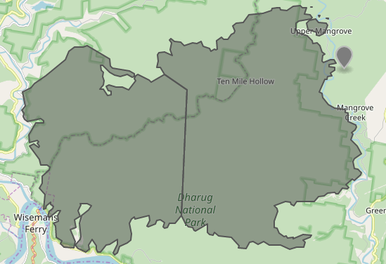

# :fire: nsw-rfs-majorincidents-geojson

The NSW Rural Fire Service (RFS) [publishes a GeoJSON feed of major incidents](http://www.rfs.nsw.gov.au/news-and-media/stay-up-to-date/feeds), this project aims to make that feed more developer friendly.

You can either build this application into your own pipeline or use the hosted URL at https://www.beyondtracks.com/contrib/nsw-rfs-majorincidents.geojson (no service availability guarantees), [preview it at geojson.io](http://geojson.io/#data=data:text/x-url,https://www.beyondtracks.com/contrib/nsw-rfs-majorincidents.geojson).

An archive of historical feed data is at [https://github.com/beyondtracks/nsw-rfs-majorincidents-archive](https://github.com/beyondtracks/nsw-rfs-majorincidents-archive).

_NSW RFS Current Incidents are © State of New South Wales (NSW Rural Fire Service). For current information go to www.rfs.nsw.gov.au. Licensed under the Creative Commons Attribution 4.0 International (CC BY 4.0)._

## Where is it used?

This pipeline has been built for [www.beyondtracks.com](https://www.beyondtracks.com) and can be viewed live at [www.beyondtracks.com/map](https://www.beyondtracks.com/map) to provide information about bush fires near bushwalks.

# Features
## Access-Control-Allow-Origin

The upstream feed lacks the Access-Control-Allow-Origin header which means web applications aren't able to use the feed directly. This was reported to the NSW RFS on the 3rd of December 2015, and as of December 2019 the header still isn't present.

The sample crontab file allows you to mirror the RFS feed and serve it with your own HTTP server, adding the Access-Control-Allow-Origin HTTP header.

## Nested GeometryCollections

The upstream feed uses nested GeometryCollections, although allowed by the [GeoJSON spec](https://tools.ietf.org/html/rfc7946), the recommendation is they SHOULD be avoided.

Nested GeometryCollections are converted to flat GeometryCollections when they include different `Geometry` types or a multipart geometry where it's possible to avoid using a GeometryCollection at all.

Since some downstream applications can have trouble ingesting GeoJSON data with GeometryCollections of varying types, the option `--avoid-geometrycollections` is provided to explode these out into multiple Features.

## Coordinate Precision

Although extra coordinate precision can help retain geometry shape even beyond the capture precision, the upstream feed uses 14 decimal places. Practically fire extents or geometry shape won't be more than 10m in accuracy so limiting to 4 decimal places will suffice.

*Temporarily disabled due to issues where small valid polygons became invalid after truncation*

## Overloaded Description

The upstream feed overloads properties into the `description` field in the format `KEY: Value  KEY: Value`. These are exploded out to make them easier to machine read in applications. The original overloaded description is dropped from the output.

## Machine Readable Schema

Within [schema/](https://github.com/beyondtracks/nsw-rfs-majorincidents-geojson/tree/master/schema) are JSON files containing the values and descriptions for Status, Alert Level and Incident Type. These can be used within web applications to provide users more information about what these terms mean.

## ISO8601 Datetimes

The upstream feed uses dates in the format `3/01/2018 5:20:00 AM` in some places and `3 Jan 2018 16:20` in other places in local time. These datetimes are converted into ISO8601 datetimes assuming the 'Australia/Sydney' time zone to avoid any ambiguities in interpretation.

## Winding Order

For extra assurances the GeoJSON winding order is enforced with https://github.com/mapbox/geojson-rewind.

## Sorted features

You can control the order of features with `--sort=original|guid|pubdate`. The default is `original` which retains the original sort order, sorting by `guid` uses ascending order and `pubdate` uses chronological order.

## Removal of Internal Shared Borders
Around November 2019 it was observed some bushfire areas were being split into multiple `Polygon` geometries within the `GeometryCollection` for the incident. Since these are purely artificial, there is no compelling reason to include them, so we attempt to remove these by unioning multiple Polygons together with [polygon-clipping](https://github.com/mfogel/polygon-clipping).

Where the internal shared borders aren't perfectly touching you can try with the `--avoid-slivers` option (off by default) which tries to remove slivers less than 25m in width.

## ID

The `guid` is used as a numeric GeoJSON Feature ID.

# Usage

Install the Node dependencies with:

    yarn install

Run the script with:

    ./bin/nsw-rfs-majorincidents-geojson nsw-rfs-majorincidents.geojson

This will download the upstream feed, process it and save the resulting GeoJSON file at `nsw-rfs-majorincidents.geojson`.

Alternatively if you've pre-downloaded an upstream feed you can run:

    ./bin/nsw-rfs-majorincidents-geojson upstream.json output.geojson

## Options

* `--pretty-print` pretty print the output, otherwise output is minified
* `--avoid-geometrycollections` explode GeometryCollections out to multiple Features to avoid the use of GeometryCollections (handy for use in QGIS which doesn't support varying geometry types within a GeometryCollection, see https://github.com/qgis/QGIS/issues/32747) (off by default)
* `--avoid-slivers` to try and remove narrow slivers in polygons (off by default)

# Schema
Each GeoJSON Feature represents a major incident. Each Feature may have multiple geometries using a GeometryCollection. For example both a point and a polygon showing a bushfire extent. Although so far every feature contains at a minimum a point geometry, without any documented guarantees about this consumers should accept features with no geometry or only a polygon geometry.

Each feature has a properties field as follows. Note that these vary from the upstream feed, the full list of possible values is unknown these are just the ones I've come across.

Key   | Type | Description | Example
------|------|-------------|---------
title | String | A short name used as the tile of this incident, given to assist with managing multiple incidents. Usually this is the name of a nearby road or geographic feature but it doesn't necessarily reflect the exact location of that incident. | `Grain Valley Rd, Boggabri`
alert-level | String | Alert level of the incident, see [#alert-level](https://github.com/beyondtracks/nsw-rfs-majorincidents-geojson#alert-level) | `emergency-warning`, `watch-and-act`, `advice`, 'not-applicable`
status | String | Status of the incident, see [#status](https://github.com/beyondtracks/nsw-rfs-majorincidents-geojson#status) | `out-of-control`, `being-controlled`, 'under-control'
guid | String | A globally unique identifier for this incident. Usually it is a non-publicly accessible URL | `https://incidents.rfs.nsw.gov.au/api/v1/incidents/285935`
pub-date | String | Datetime in ISO8601 of when the incident was first published | `2018-01-05T23:41:00+11:00`
updated | String | Datetime in ISO8601 of when the incident details were last updated | `2018-01-06T10:41:00+11:00`
responsible-agency | String | The name of the agency responsible for responding to the incident | `Rural Fire Service`, `NSW National Parks and Wildlife Service`.
size | String | The ground area which the incident affects | `2790 ha`
type | String | The type of incident, see [#incident-type](https://github.com/beyondtracks/nsw-rfs-majorincidents-geojson#incident-type) | `bush-fire`, `medical`, `grass-fire`
fire | boolean | Indicates if this this incident a fire (`true`) or not (`false`) | `true`, `false`
council-area | String | Short name of the council area the incident falls in | `Wollongong`
location | String | A description of the location of the incident | `Coast Trk, Lilyvale, NSW 2508`, `150.79 -33.30`

## Status

Status Name | Description
------------|-------------
Out of control | A fire which is spreading on one or more fronts. Effective containment strategies are not in place for the entire perimeter.
Being controlled | Effective strategies are in operation or planned for the entire perimeter.
Under control | The fire is at a stage where fire fighting resources are only required for patrol purposes and major re-ignition is unlikely.

## Alert Level

Alert Level Name | Description
-----------------|-------------
Emergency Warning| An Emergency Warning is the highest level of Bush Fire Alert. You may be in danger and need to take action immediately. Any delay now puts your life at risk.
Watch and Act    | There is a heightened level of threat. Conditions are changing and you need to start taking action now to protect you and your family.
Advice           | A fire has started. There is no immediate danger. Stay up to date in case the situation changes.
Not Applicable   | |

## Incident Type

Incident Type Name | Description
-------------------|-------------
Bush Fire | Forest and/or Scrub Fire
Grass Fire | Grass Fire
Hazard Reduction | Planned controlled burns to reduce bush fire hazards
Structure Fire | A fire involving a residential, commercial or industrial building
Haystack Fire | Haystack fire
HAZMAT | The NSW RFS provides operational support to the Fire & Rescue NSW for hazardous materials incidents
MVA/Transport | Transport incidents including motor vehicle accident, aircraft incident and incidents involving a railway or railway rolling stock
Assist Other Agency | Assist other agency such as Fire & Rescue NSW, NSW Police, NSW SES, NSW Ambulance, Defence Force, interstate deployments etc
Search/Rescue | Search and Rescue, rescue animal
Flood/Storm/Tree Down | Assisting with Flood or storm damage or tree down
Vehicle/Equipment Fire | Vehicle or Equipment fire such as car fire, farm machinery fire, transformer fire etc
Burn off | Burn off such as stubble fire, pile burn etc
Fire Alarm | Automatic Fire Alarm or Domestic Smoke Alarm
Medical | Medical incident such as medical evacuation
Other | Other incidents such as smoke in vicinity, gas leak, building collapse etc

# Warranty

The information in the RFS feed can affect life and property. Although the aim of this project is to make the RFS feed more safe, usable and reliable for data consumers, errors or omissions may be present and/or the upstream supplied data structure may change without any notice causing issues. Use at your own risk.

THIS SOFTWARE IS PROVIDED ``AS IS'' AND WITHOUT ANY EXPRESS OR
IMPLIED WARRANTIES, INCLUDING, WITHOUT LIMITATION, THE IMPLIED
WARRANTIES OF MERCHANTABILITY AND FITNESS FOR A PARTICULAR PURPOSE.
